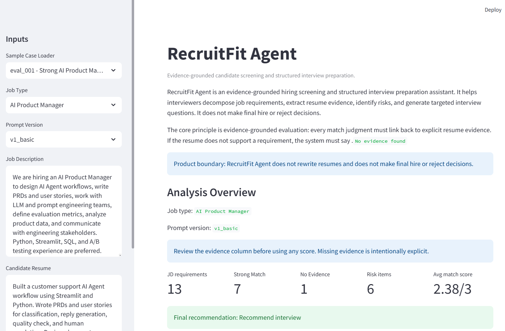
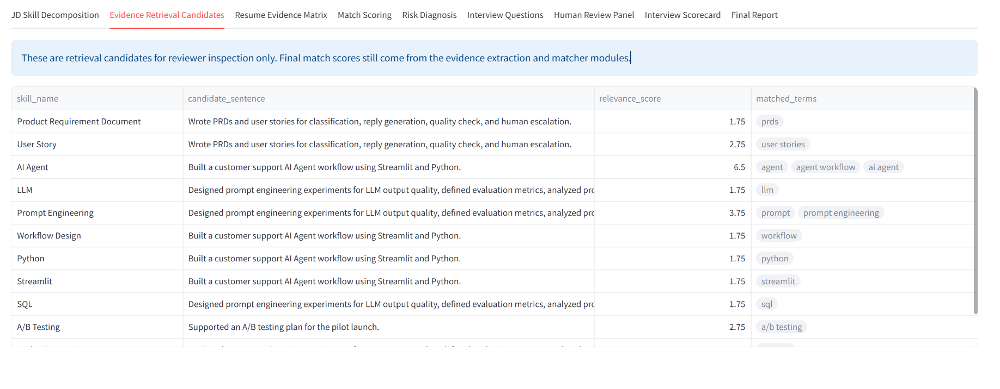
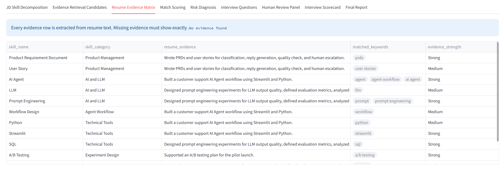
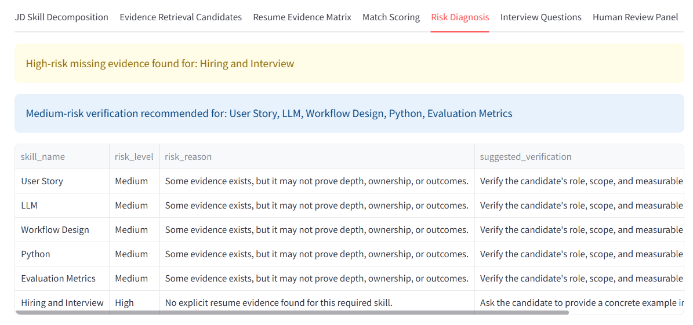
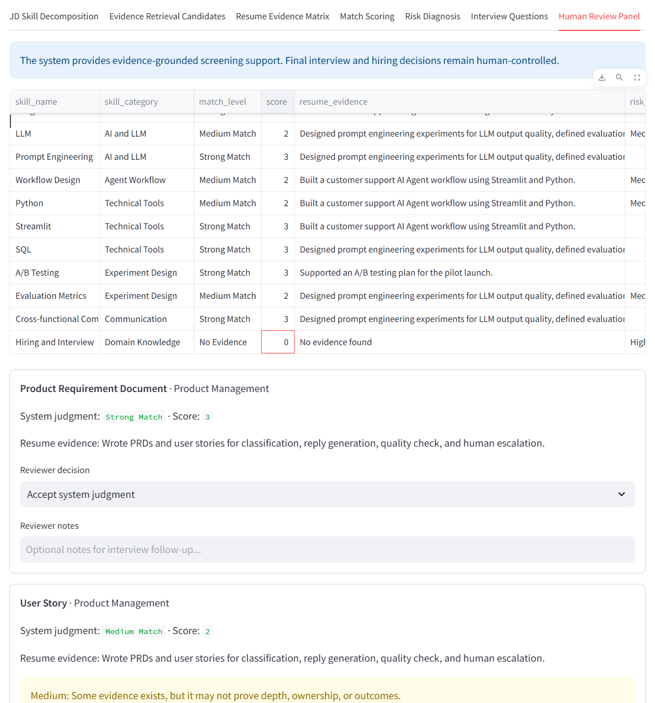
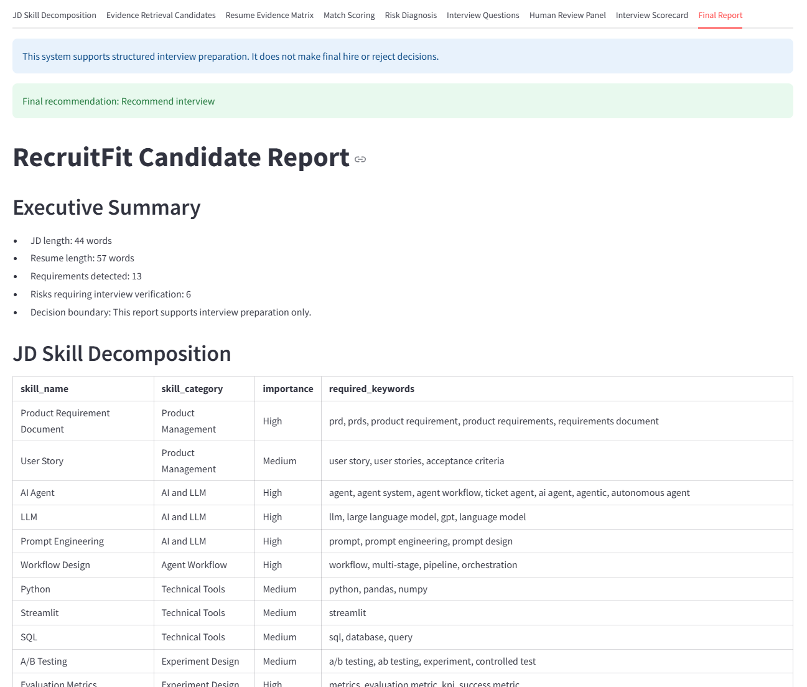

# RecruitFit Agent

RecruitFit Agent is an evidence-grounded hiring screening and structured interview preparation assistant. It helps interviewers decompose job requirements, extract explicit resume evidence, identify risks, and generate targeted interview questions.

The MVP is rule-based, fully offline, and designed as a GitHub portfolio project for AI Product Manager, Agent Product, and LLM application internship interviews.

## Project Overview

RecruitFit Agent takes a job description and a candidate resume as input, then produces a structured candidate evaluation report for interview preparation.

The core product principle is evidence-grounded evaluation. Every match judgment must link back to explicit resume evidence. If the resume does not support a requirement, the system outputs exactly:

```text
No evidence found
```

## Product Positioning

RecruitFit Agent is designed for:

- HR recruiters
- Business interviewers
- Hiring managers

It is not:

- A resume rewriting tool
- A final hire or reject decision-maker
- A generic HR comment generator

The system supports structured interview preparation by helping reviewers see what evidence exists, what evidence is missing, and what should be verified during the interview.

## Key Features

- JD skill decomposition
- Resume evidence extraction
- Evidence retrieval candidates
- Evidence-based match scoring
- Risk diagnosis
- Structured interview questions
- Human review panel
- Final candidate report

## Agent Workflow

```text
Job Description + Resume
-> JD Requirement Decomposition
-> Evidence Retrieval Candidates
-> Resume Evidence Extraction
-> Evidence-based Match Scoring
-> Risk Diagnosis
-> Interview Question Generation
-> Human Review Panel
-> Final Candidate Report
```

## Demo Preview

### Demo Overview



### Evidence Retrieval Candidates



### Resume Evidence Matrix



### Risk Diagnosis



### Human Review Panel



### Final Report



## Evidence-grounded Design

RecruitFit Agent avoids unsupported inference by making evidence visible at every stage.

- Every match judgment must link to explicit resume evidence.
- Missing evidence is shown as `No evidence found`.
- Match scoring is based on extracted evidence, not assumptions.
- Human reviewers can inspect evidence and mark items for manual verification.
- The system does not make final hire or reject decisions.

## Evaluation Result

The project includes a small simulated evaluation set in `data/eval_cases.json`.

Current evaluation summary:

- total cases: 10
- total checks: 80
- passed checks: 78
- failed checks: 2
- initial pass rate: 76.25%
- after controlled rule iteration: 97.50%

This is a rule-check pass rate on a small evaluation set, not real-world hiring accuracy.

The remaining failures were intentionally left unresolved because the relevant JD text did not explicitly contain the expected skill requirement. This preserves the evidence-grounded principle and avoids over-expanding generic keyword matching.

## LLM-ready Extension Plan

The current MVP is rule-based and fully offline. It does not call external LLM APIs or require API keys.

The project includes LLM-ready prompt builders in `src/llm_extraction_prompt.py` for future:

- JD requirement extraction
- Resume evidence extraction
- Evidence guardrail review

Future versions could replace or assist the rule-based retrieval layer with embedding-based retrieval or vector search. Human-in-the-loop review should remain part of the workflow so final interview and hiring decisions stay human-controlled.

See `docs/llm_extension_plan.md` for more detail.

## Project Structure

```text
recruitfit-agent/
|-- app.py
|-- requirements.txt
|-- src/
|   |-- jd_parser.py
|   |-- resume_evidence.py
|   |-- evidence_retriever.py
|   |-- matcher.py
|   |-- risk_analyzer.py
|   |-- interview_generator.py
|   |-- report_builder.py
|   `-- llm_extraction_prompt.py
|-- data/
|   `-- eval_cases.json
|-- docs/
|-- prompts/
|-- scripts/
|   `-- run_eval.py
|-- screenshots/
`-- outputs/
```

## How to Run

Install dependencies:

```bash
pip install -r requirements.txt
```

Run the Streamlit demo:

```bash
streamlit run app.py
```

Run evaluation:

```bash
python scripts/run_eval.py
```

## Limitations and Future Work

Current limitations:

- Rule-based matching is limited and can miss nuanced evidence.
- Evaluation data is simulated and small.
- Real resumes require privacy protection, secure handling, and compliance review.
- The system does not yet store reviewer feedback.

Future work:

- Add LLM-assisted JD and resume evidence extraction
- Add embedding-based retrieval or vector search
- Add reviewer feedback storage and audit logs
- Expand the evaluation set with more roles and resume formats
- Add privacy, bias, and compliance review checks
